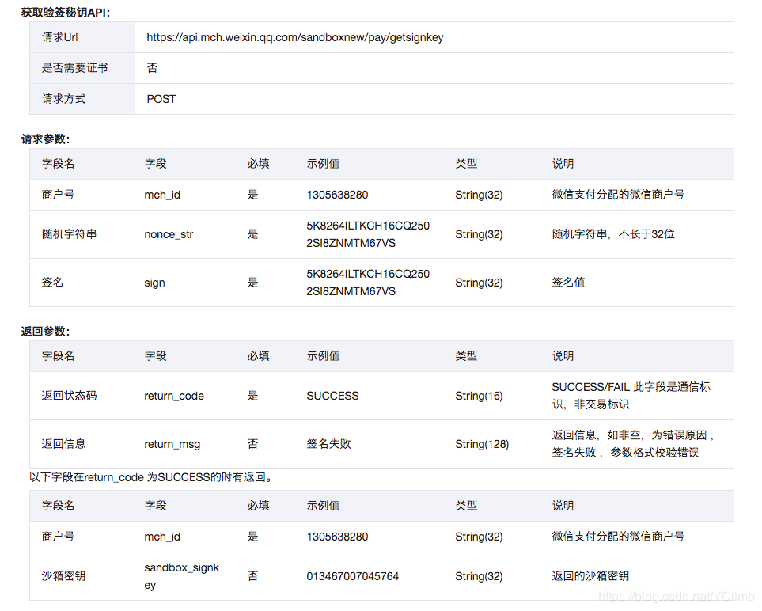

仿真系统与生产环境完全独立，包括存储层。商户在仿真系统所做的所有交易（如下单、支付、查询）均为无资金流的假数据，即：用户无需真实扣款，
商户也不会有资金入账。代金券同理，沙箱环境中无需商户真实制券与发券，亦不会出现真实扣券情况。验收仿真测试系统的API验签密钥需从API获取:

仿真测试系统的API验证签名

仿真API文档地址：https://pay.weixin.qq.com/wiki/doc/api/jsapi.php?chapter=23_1